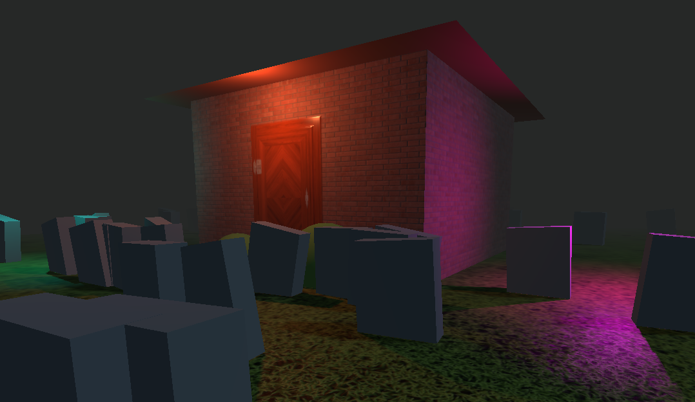

# Three.js haunted house

A really simple, semi-spooky, 3D experience built with Three.js using:

- MeshStandardMaterial
- Alpha Maps
- Ambient Occlusion Maps
- Displacement Maps
- Normal Maps
- Metalness Maps
- Roughness Maps
- Lights and Shadows

[](https://threejs-haunted-house-apaydev.vercel.app)

## TODOs:

- Add random names and epithaps to each tombstone using TextGeometry and Faker.js.
- Add a GUI from which all of the properties of the scene can me modified.

## How to run it

> [!WARNING]
> Don't use the textures provided for comercial purposes, since they most likely require a special license.

After cloning the repo, run the following command to install the required dependencies:

```bash
npm i
```

Then, to start the development server, run:

```bash
npm run dev
```
